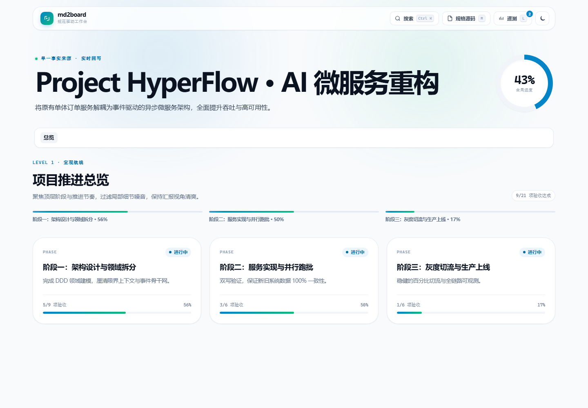
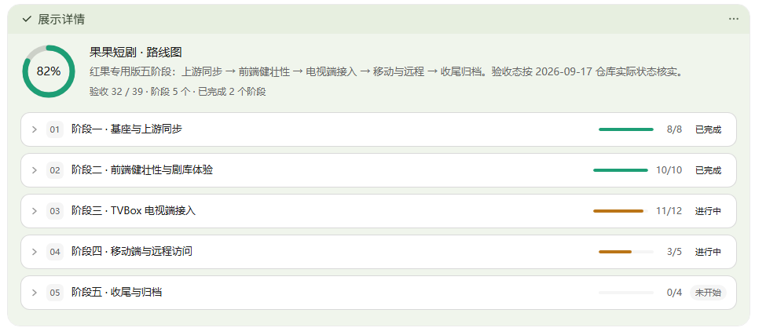
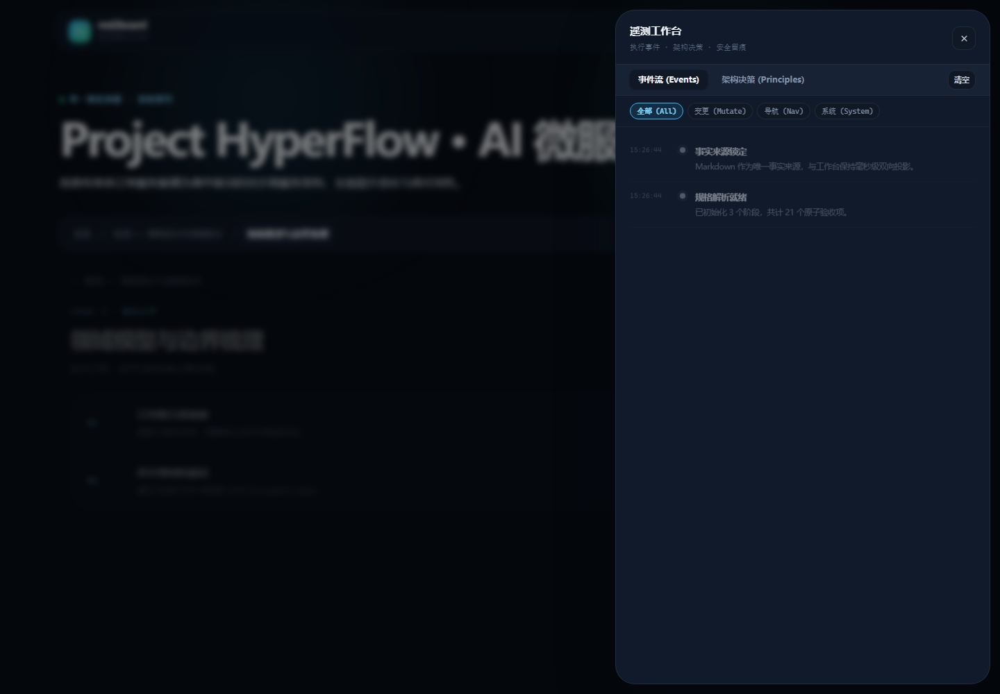

# md2board

> Markdown 进，看板出。

把结构化 Markdown 项目规格转换为汇报级交互看板：支持四级下钻、验收项勾选、进度实时回算、代码 diff 快照、深浅色主题与离线打开。



### 在 WorkBuddy 中内联使用

无需生成独立文件，可直接在对话中展示紧凑的项目进度看板。



<details>
<summary>完整 HTML 看板的更多界面</summary>

**Level 4 · 验收清单与增量 diff**


**深色主题 · 遥测工作台**



</details>

## 特性

- **Markdown 是唯一事实源**：进度只由 `- [x]` / `- [ ]` 验收项计算，无需手写百分比。
- **四级结构映射**：`#` / `##` / `###` / `####` 分别对应项目、阶段、章节和小节。
- **交互式下钻**：从阶段总览逐级进入验收清单，支持面包屑、快捷键和模糊跳转。
- **实时回算**：勾选验收项后，小节、章节、阶段和全局进度同步更新。
- **增量快照**：小节中的 `diff` 代码块可直接展示关键变更。
- **单文件交付**：生成的 HTML 无外链、无需服务器，可离线打开和投屏。
- **双渲染模式**：既能生成完整 HTML，也能在支持 HTML widget 的对话界面中内联展示精简看板。

## 四级结构

| 层级 | Markdown 输入 | 看板展示 |
|---|---|---|
| Level 1 | `# 项目`、`## 阶段` | 阶段卡片、推进轴、全局进度圆环 |
| Level 2 | `### 章节` | 章节卡片 |
| Level 3 | `#### 小节` | 小节列表与进度条 |
| Level 4 | `- [ ]`、`- [x]`、`diff` 代码块 | 验收清单与增量快照 |

常用交互：`Ctrl/Cmd + K` 跳转任意层级，`L` 打开遥测抽屉，`M` 打开规格编辑器，`Esc` 返回上一级。

## 安装

克隆到智能体的技能目录：

```bash
git clone https://github.com/outmanwt/md2board.git ~/.workbuddy/skills/md2board
```

也可放入其他兼容 `SKILL.md` 的技能目录，例如 `~/.claude/skills/md2board` 或 `~/.agents/skills/md2board`。项目只使用 Markdown、HTML 和原生 Node.js 脚本，不依赖宿主专有 API。

## 快速开始

### 1. 编写项目规格

````markdown
# 项目标题
> 一句话目标

## 阶段名称
> 阶段目标

### 章节名称
> 章节职责

#### 小节名称
> 小节落地目标
- [x] 已完成的验收项
- [ ] 待完成的验收项

```diff
+ 新增的关键逻辑
- 废弃的旧代码
```
````

完整语法见 [`references/spec-contract.md`](references/spec-contract.md)。

### 2. 生成看板

在技能根目录执行：

```bash
node scripts/generate_deck.js progress.md --output dashboard.html
```

生成结果是一个自包含 HTML 文件，可直接用浏览器打开。

也可以先用示例规格体验：

```bash
node scripts/generate_deck.js assets/sample-progress.md --output dashboard.html
```

### 3. 保存勾选结果

看板中的勾选状态默认保存在浏览器本地缓存中。需要写回 Markdown 时，按 `M` 打开规格编辑器，点击“导出 .md”，再覆盖原规格文件。

## 内联看板

[`assets/inline-board.html`](assets/inline-board.html) 是一段不含 `DOCTYPE`、`head` 和 `body` 的 HTML 片段，可用于支持 HTML widget 的对话界面。

使用时替换其中的 `PD` 数据对象：

```text
phases[].chapters[].sections[].items[].done
```

内联模式适合快速审阅；完整 HTML 更适合交付、存档和汇报。

## 项目结构

```text
.
├── SKILL.md                    技能定义与调用工作流
├── README.md                   使用说明
├── LICENSE                     MIT 许可证
├── references/
│   └── spec-contract.md        Markdown 语法契约
├── scripts/
│   ├── generate_deck.js        看板生成器
│   └── verify.js               回归测试
└── assets/
    ├── template.html           完整看板模板
    ├── inline-board.html       内联看板片段
    ├── sample-progress.md      示例规格
    └── screenshots/            完整看板与 WorkBuddy 内联效果图
```

## 验证

修改模板或生成器后运行：

```bash
node scripts/verify.js
```

预期结果：`32 pass / 0 fail`。

## License

[MIT](LICENSE) © outmanwt
